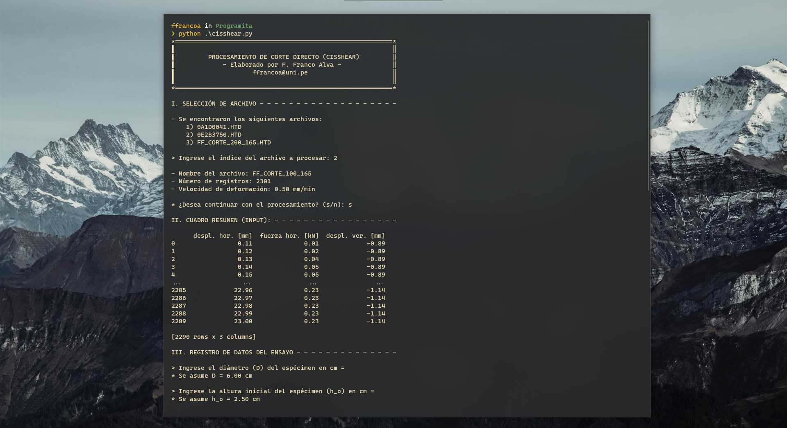

# Procesamiento de Ensayos de Laboratorio 🔬
Programas destinados a automatizar cálculos o filtros dentro del procesamiento de ensayos de laboratorio de la rama de Ingeniería Geotécnica ⛰️.

1. CISSHEAR: Programa que realiza filtros e interpolaciones al registro obtenido por el *Humboldt Direct Shear Testing Equipment*.
  
